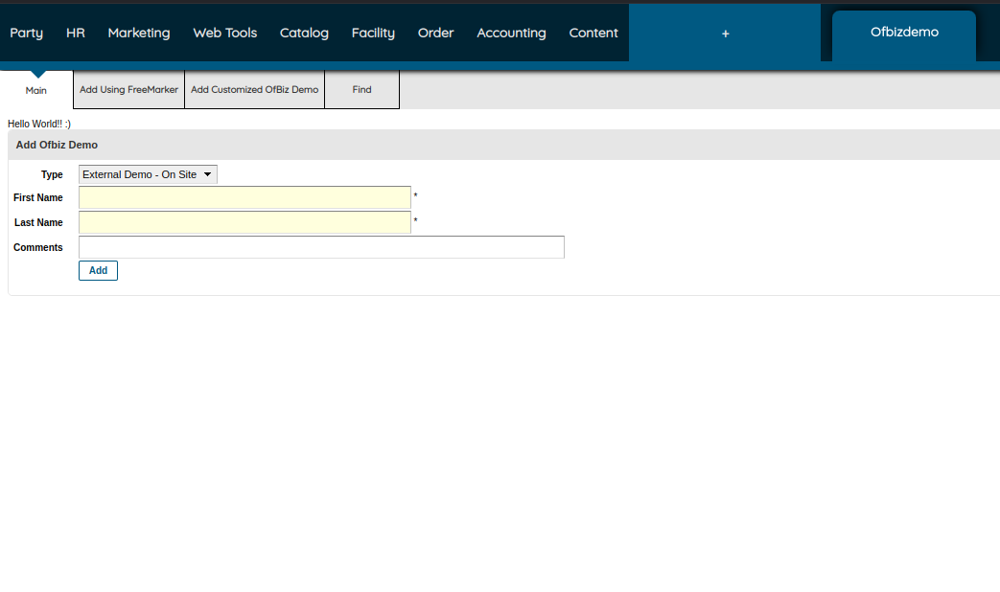
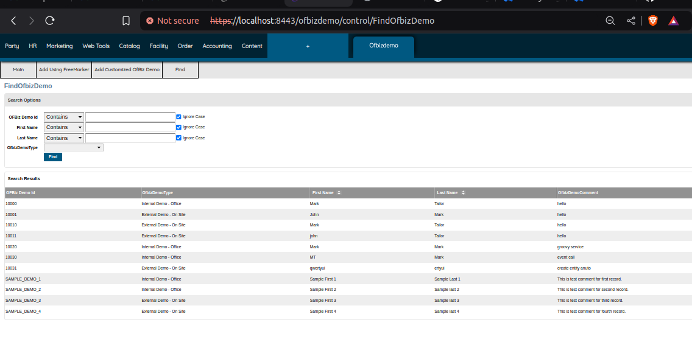
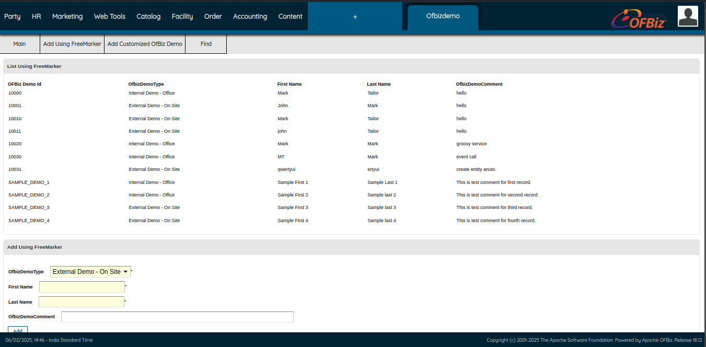
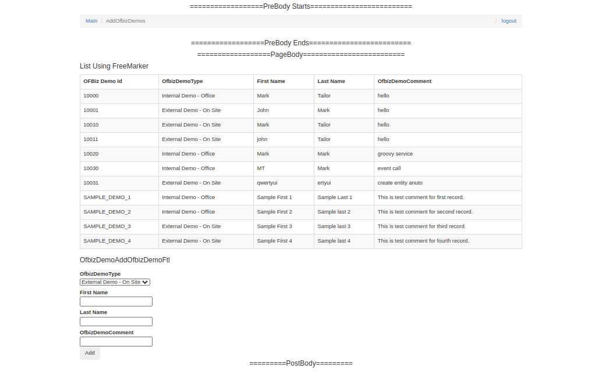

# OFBiz Beginner Task

## Table of Contents

1. **Download Apache OFBiz Framework** – Download and set up the Apache OFBiz framework on your local machine.
2. **Running Apache OFBiz** – Learn how to start and run the Apache OFBiz application.
3. **Create Your First Application (Hello World)** – Develop a simple "Hello World" application using Apache OFBiz.
4. **Create the Plugin/Component** – Create a plugin/component to integrate your application with OFBiz.
5. **Running Your First Application** – Run your first OFBiz application through the web interface to test functionality.
6. **Creating the First Database Entity (Table)** – Define and create a new database table (entity) in OFBiz.
7. **Defining the Entity** – Define the structure of the entity in XML format for database interaction.
8. **Loading Data in the Entity** – Populate the newly created entity with initial data using OFBiz services.
9. **Form and Services**
    - **Create a Service** – Develop a service to handle business logic in OFBiz.
    - **Use of UI Labels (Introduction)** – Introduce UI labels for consistent text across the interface.
    - **Create the Add Form** – Design a form to add data into the database entity.
    - **Controller Entry for Form** – Create a controller to link the form with the service logic.
    - **Create the Find Form** – Build a form to retrieve and display data from the database.
    - **Use of UI Labels (Completion)** – Complete the setup for UI labels to enhance user interaction.
10. **Services Using Other Engines**
    - **Service in Java** – Implement a service using Java for more complex logic.
    - **Service in Groovy** – Create a service in Groovy for simpler scripting solutions.
11. **Events**
    - **Events Demonstration** – Demonstrate how to trigger events for specific actions in OFBiz.
    - **Difference Between Service and Event** – Clarify the distinction between services (business logic) and events (asynchronous triggers).
12. **Creating a Custom UI** – Customize the UI by creating a custom forms and layout to display list for better presentation.
13. **Creating a Custom Decorator** – Customize the UI by creating a custom decorator for better presentation.

## Implementation ScreenShots

---

---

---

---